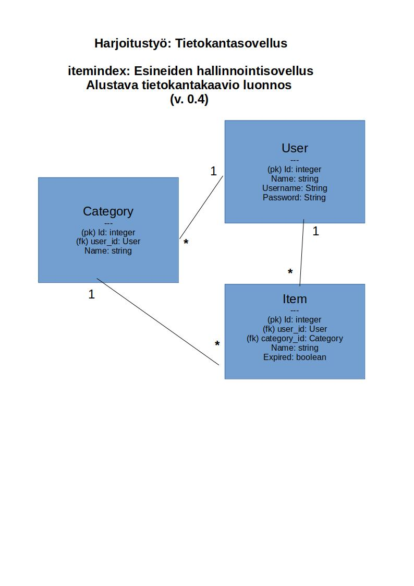

# itemindex

# Aineopintojen harjoitustyö: Tietokantasovellus

## Kuvaus sovelluksen toiminnallisuudesta:

Tehtävänä on luoda tietokantasovellus, jonka avulla käyttäjä voi hallinnoida hallussaan olevia esineitä.

Tarkoituksena on, että valmis sovellus sisältää seuraavat ominaisuudet:
- Käyttäjätunnusten luominen
- Esineiden lisääminen, muokkaaminen, poistaminen
- Kategorioiden lisääminen, muokkaaminen, poistaminen
- Kategorian liittäminen esineeseen
- Esineen merkkaaminen poistettavaksi, uusittavaksi tai hankittavaksi
- Esineiden listaaminen esim. seuraavilla tavoilla:
  - Kaikki omistamani esineet
  - Tiettyyn itse määrittämääni kategoriaan tai kategorioihin kuuluvat esineet
  - Kaikki vanhentuneet esineet
  - Kaikki poistettavaksi merkatut esineet
  - Kaikki vanhentuneet esineet
  - Kaikki hankittavat esineet

Lisää kuvauksia toiminnallisuuksista löytyy myös [käyttötapauskuvauksista](./documentation/use_cases.md)

## Asennus & käyttöohjeet

[Käyttöohjeita](./documentation/user_manual.md)

## Keskeisimmät käyttötapaukset

[Linkki keskeisimpien käyttötapausten kuvauksiin](./documentation/use_cases.md)

## SQL lauseet tietokannan luomiseen ja tiedonhakuihin

[SQL kyselyt](./documentation/sql_kyselyt.md)

## Tietokantakaavio

## Sovelluksen jatkokehitysideoita

Sovelluksen tulevaisuudessa tehtävää jatkokehitystä ajatellen voisi olla hyvä idea toteuttaa mm. seuraavat parannukset:

- Useamman kuin yhden kategorian määrittäminen esineelle
- Ulkoasun parantelu, mm. esine-listauksen sarakeleveyksien osalta yms.
- Toteutumattomien käyttötapausten lisääminen sovellukseen
- Kattavammat oikeuksien tarkistukset ja validoinnit syötteille
- Salasanojen salaaminen tietokannassa
