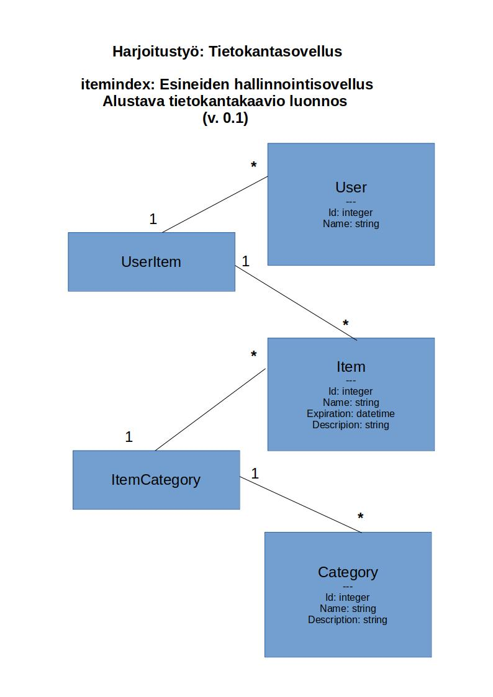

# itemindex

# H1 Aineopintojen harjoitustyö: Tietokantasovellus

# H2 Alustava kuvaus sovelluksen toiminnallisuudesta:

Tehtävänä on luoda tietokantasovellus, jonka avulla käyttäjä voi hallinnoida hallussaan olevia esineitä. Tarkoituksena on, että käyttäjä pystyy sovelluksen avulla määrittämään jokaiselle esineelle jonkin oletetun käyttöajan, jonka jälkeen esine vanhenee, eli johon mennessä se on tullut käyttöikänsä päähän ja pitää uusia. Käyttötarkoitus on sovellettavissa monenlaisiin tarkoituksiin jääkaapin sisällön hallinnoimisesta koko omaisuuden listaamiseen asti. Idean taustalla on joskus aikoinaan minimalistien keskuudessa suosittu 100-esinettä haaste, jossa listattiin kaikki esineet, jotka omistaa ja kilpailtiin siitä, kuka pääsee lähimmäs sataa (huvinsa kullakin!).

Eli sovelluksessa on siis tarkoitus pystyä lisäämään/poistamaan ja listaamaan esineitä. Esineille määritellään kategoria (esim. core, essential, work, hobby, luxyry...) ja käyttöikä. Esineiden nimiä ja niihin liittyviä kategorioita yms. pitää voida muokata, kuin myös kategorioiden nimiä ja niihin liittyviä ominaisuuksia.

Tietokannasta pitää olla mahdollista hakea erilaisia listauksia esineistä, esim. kaikki esineet, tietyn kategorian esineet vanhentueet esineet yms.

# H2 Tietokantakaavio (alustava luonnos)

